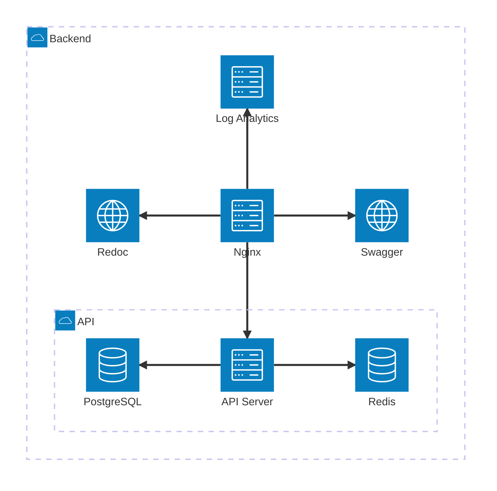

# Architecture

## Backend

```mermaid
architecture-beta
    group backend(cloud)[Backend]

        service nginx(server)[Nginx] in backend
        service analytics(server)[Log Analytics] in backend
        service swagger(internet)[Swagger] in backend
        service redoc(internet)[Redoc] in backend

        group api(cloud)[API] in backend
    
            service go(server)[API Server] in api
            service redis(database)[Redis] in api
            service postgres(database)[PostgreSQL] in api

    nginx:T --> B:analytics
    nginx:R --> L:swagger
    nginx:L --> R:redoc

    nginx:B --> T:go
    go:L --> R:postgres
    go:R --> L:redis
```
